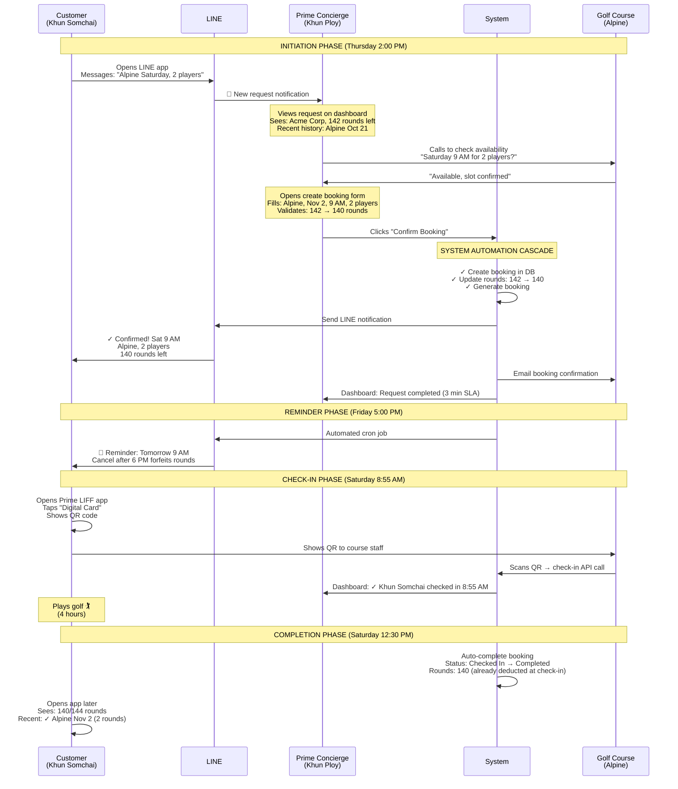
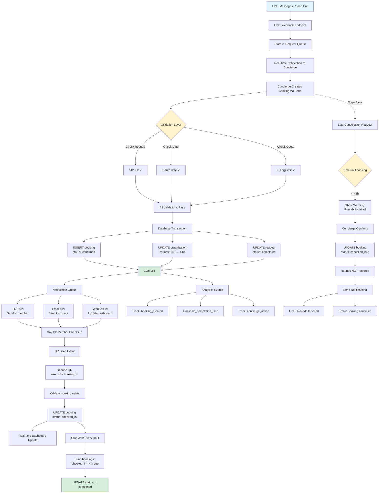
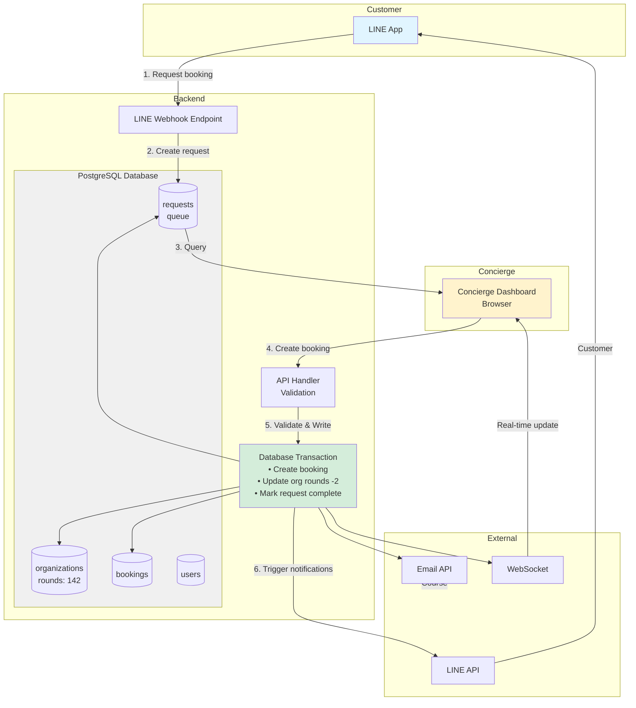
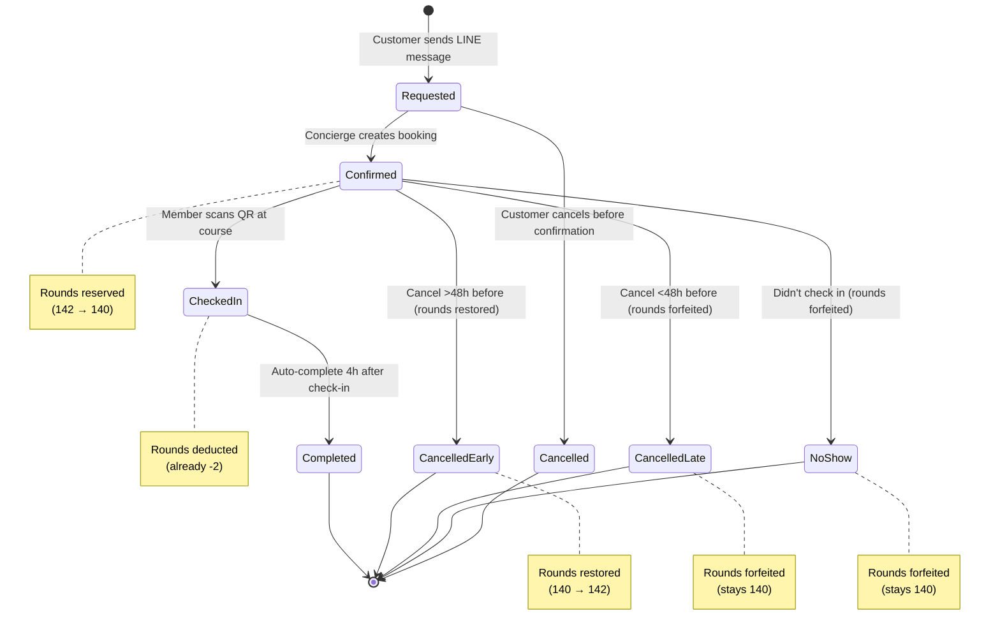

# Prime Golf Booking Flow - Visual Diagram

## Two-Sided User Story: Customer & Prime Manager



---

## Detailed Flow with UI Touchpoints

### Customer Perspective (Minimal Friction)

```
┌─────────────────────────────────────────────────────────────────┐
│                    CUSTOMER JOURNEY                             │
│                   (Total Active Time: 20 seconds)               │
└─────────────────────────────────────────────────────────────────┘

Step 1: INITIATE REQUEST (10 sec)
┌──────────────────┐
│  📱 LINE App     │
│                  │
│  Prime Concierge │
│  [Type message]  │
│                  │
│  "Alpine         │
│   Saturday,      │
│   2 players"     │
│                  │
│  [Send ▶]        │
└──────────────────┘

Step 2: RECEIVE CONFIRMATION (Passive - 5 min later)
┌──────────────────┐
│  🔔 Notification │
│                  │
│  Prime Concierge │
│  ✓ Confirmed!    │
│                  │
│  Sat, Nov 2      │
│  Alpine 9:00 AM  │
│  2 players       │
│                  │
│  Rounds: 140/144 │
│  [View Details]  │
└──────────────────┘

Step 3: RECEIVE REMINDER (Passive - day before)
┌──────────────────┐
│  🔔 Notification │
│                  │
│  🏌️ Tomorrow!   │
│  9:00 AM Alpine  │
│                  │
│  Need to cancel? │
│  Reply here.     │
└──────────────────┘

Step 4: CHECK-IN (10 sec)
┌──────────────────┐
│  Prime App       │
│  Digital Card    │
│                  │
│  ┌────────────┐  │
│  │  QR CODE   │  │
│  │  ████████  │  │
│  │  ████████  │  │
│  │  ████████  │  │
│  └────────────┘  │
│                  │
│  Khun Somchai    │
│  USER_001        │
│  Acme Corp       │
└──────────────────┘
        │
        ▼
   Show to staff → ✓ Checked in

Step 5: POST-ROUND (Automatic)
┌──────────────────┐
│  Prime App       │
│  Home            │
│                  │
│  🏆 Rounds       │
│     140 / 144    │
│                  │
│  Recent:         │
│  ✓ Alpine Nov 2  │
│    2 rounds      │
│                  │
│  📅 Upcoming:    │
│    (none)        │
└──────────────────┘
```

---

### Concierge Perspective (Maximum Efficiency)

```
┌─────────────────────────────────────────────────────────────────┐
│                   CONCIERGE WORKFLOW                            │
│              (From Request to Confirmation: < 1 min)            │
└─────────────────────────────────────────────────────────────────┘

Step 1: REQUEST RECEIVED
┌────────────────────────────────────────────────────────┐
│  Prime Concierge Dashboard                 🔔 1 New    │
├────────────────────────────────────────────────────────┤
│  Pending Requests (1)                                  │
│  ┌──────────────────────────────────────────────────┐ │
│  │ 🔔 Request #1247                    2 min ago    │ │
│  │                                                   │ │
│  │ Khun Somchai (Acme Corporation)                  │ │
│  │ "Want to play Alpine this Saturday, 2 players"   │ │
│  │                                                   │ │
│  │ Rounds: 142/144  |  Status: Active               │ │
│  │ Preferences: Morning tee times                   │ │
│  │                                                   │ │
│  │ Recent:                                          │ │
│  │ • Oct 28 - Siam Country (2 rounds)              │ │
│  │ • Oct 21 - Alpine (1 round)                     │ │
│  │                                                   │ │
│  │ [Create Booking]  [Reply via LINE]              │ │
│  └──────────────────────────────────────────────────┘ │
└────────────────────────────────────────────────────────┘

Step 2: CHECK AVAILABILITY (External - 1 min)
┌────────────────────────────────────┐
│  ☎️ Call Alpine Golf Club         │
│                                    │
│  "Hi, checking availability        │
│   for Saturday Nov 2               │
│   Morning slot, 2 players"         │
│                                    │
│  → "9:00 AM available"             │
│  → "Reserved for Acme Corporation" │
└────────────────────────────────────┘

Step 3: CREATE BOOKING (Form - 30 sec)
┌────────────────────────────────────────────────────────┐
│  Create Booking                                    × │
├────────────────────────────────────────────────────────┤
│  Organization                                          │
│  ┌──────────────────────────────────────────────────┐ │
│  │ Acme Corporation ▼                               │ │
│  └──────────────────────────────────────────────────┘ │
│  Auto-filled from request                              │
│                                                        │
│  Primary Member                                        │
│  ┌──────────────────────────────────────────────────┐ │
│  │ Khun Somchai ▼                                   │ │
│  └──────────────────────────────────────────────────┘ │
│                                                        │
│  Golf Course                                           │
│  ┌──────────────────────────────────────────────────┐ │
│  │ Alpine Golf Club ▼                               │ │
│  └──────────────────────────────────────────────────┘ │
│                                                        │
│  Date & Time                                           │
│  ┌─────────────────┐  ┌─────────────────┐            │
│  │ Nov 2, 2024 📅  │  │ 09:00 AM ▼      │            │
│  └─────────────────┘  └─────────────────┘            │
│                                                        │
│  Players                                               │
│  ┌──────────────────────────────────────────────────┐ │
│  │ ☑ Khun Somchai (Primary Member)                 │ │
│  │ ☑ Guest (Name optional)                          │ │
│  └──────────────────────────────────────────────────┘ │
│  Total: 2 players                                      │
│                                                        │
│  ┌──────────────────────────────────────────────────┐ │
│  │ ⚡ Rounds Calculation                            │ │
│  │                                                   │ │
│  │ Current: 142 rounds                              │ │
│  │ Using:   -2 rounds                               │ │
│  │ After:   140 rounds                              │ │
│  │                                                   │ │
│  │ ✓ Sufficient rounds available                    │ │
│  └──────────────────────────────────────────────────┘ │
│                                                        │
│  [Cancel]                    [Confirm Booking →]      │
└────────────────────────────────────────────────────────┘

Step 4: CONFIRMATION (Automatic cascade)
┌────────────────────────────────────────────────────────┐
│  ✓ Booking Created Successfully                       │
├────────────────────────────────────────────────────────┤
│  Booking #BR-2024-1247                                 │
│                                                        │
│  Acme Corporation - Khun Somchai                       │
│  Alpine Golf Club                                      │
│  Saturday, November 2 at 9:00 AM                       │
│  2 Players                                             │
│                                                        │
│  ✓ Member notified via LINE                           │
│  ✓ Course notified via email                          │
│  ✓ Rounds updated: 140 remaining                      │
│  ✓ Request #1247 marked complete                      │
│  ✓ SLA: Completed in 3 minutes                        │
│                                                        │
│  [View Booking]  [Back to Dashboard]                  │
└────────────────────────────────────────────────────────┘

Step 5: DAY OF - TRACKING
┌────────────────────────────────────────────────────────┐
│  Today's Bookings - Saturday, Nov 2                    │
├────────────────────────────────────────────────────────┤
│  Alpine Golf Club (3 bookings)                         │
│  ┌──────────────────────────────────────────────────┐ │
│  │ ✓ 8:00 AM  Khun Prakit        Checked in 7:55   │ │
│  │ ✓ 9:00 AM  Khun Somchai       Checked in 8:55   │ │
│  │ ⏱ 10:00 AM Khun Narong        Not checked in    │ │
│  └──────────────────────────────────────────────────┘ │
│                                                        │
│  Siam Country Club (1 booking)                         │
│  ┌──────────────────────────────────────────────────┐ │
│  │ ✓ 9:30 AM  Khun Pensri        Checked in 9:25   │ │
│  └──────────────────────────────────────────────────┘ │
│                                                        │
│  🔔 Alert: Khun Narong late (10:15 AM)                │
└────────────────────────────────────────────────────────┘

Step 6: AUTO-COMPLETION
┌────────────────────────────────────────────────────────┐
│  Booking #BR-2024-1247 - COMPLETED                     │
├────────────────────────────────────────────────────────┤
│  Khun Somchai (Acme Corporation)                       │
│  Alpine Golf Club - November 2                         │
│                                                        │
│  Timeline:                                             │
│  • Requested:  Thu 2:00 PM                            │
│  • Confirmed:  Thu 2:03 PM (3 min)                    │
│  • Checked in: Sat 8:55 AM (5 min early)              │
│  • Completed:  Sat 12:30 PM (auto)                    │
│                                                        │
│  Rounds Used: 2                                        │
│  Rounds Remaining: 140                                 │
│                                                        │
│  Status: ✓ Completed                                  │
└────────────────────────────────────────────────────────┘
```

---

## System Architecture Flow



---

## Data Flow Diagram



---

## Booking State Diagram



---

## Key Touchpoints Summary

| Actor | Tool | Action | Time |
|-------|------|--------|------|
| **Customer** | LINE app | Send booking request | 10 sec |
| **Concierge** | Dashboard | Receive notification | Real-time |
| **Concierge** | Phone | Check course availability | 1 min |
| **Concierge** | Web form | Create booking | 30 sec |
| **System** | Database | Validate & save booking | < 1 sec |
| **System** | LINE API | Send confirmation to customer | < 1 sec |
| **System** | Email API | Send booking to course | < 1 sec |
| **System** | Dashboard | Update UI (WebSocket) | Real-time |
| **Customer** | LINE | Receive confirmation | Passive |
| **Customer** | LIFF app | View upcoming bookings | On-demand |
| **System** | Cron job | Send reminder (24h before) | Automated |
| **Customer** | LIFF app | Show QR code for check-in | 10 sec |
| **Course** | Scanner | Scan QR code | 5 sec |
| **System** | Database | Record check-in | < 1 sec |
| **Concierge** | Dashboard | See check-in status | Real-time |
| **System** | Cron job | Auto-complete booking (4h after) | Automated |

**Total Customer Active Time: ~20 seconds**
**Total Concierge Active Time: ~2 minutes** (including phone call to course)

